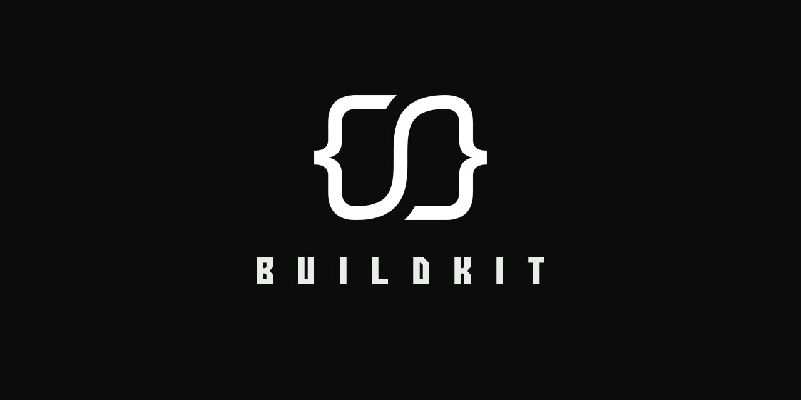

> A work in progress API boilerplate / practical implementation and base feature
> set to save me time repeating the same code every time I start a new one.

## Service endpoints

- [API](http://localhost:8080/)
- [Jaeger UI](http://localhost:16686/)

## Build strategies

| Event          | Ref                    | Commit SHA | Docker Tags                       |
|----------------|------------------------|------------|-----------------------------------|
| `schedule`     | `refs/heads/master`    | `45f132a`  | `sha-45f132a`, `nightly`          |
| `pull_request` | `refs/pull/2/merge`    | `a123b57`  | `sha-a123b57`, `pr-2`             |
| `push`         | `refs/heads/main`      | `cf20257`  | `sha-cf20257`, `edge`             |
| `push`         | `refs/heads/my/branch` | `a5df687`  | `sha-a5df687`, `my-branch`        |
| `push tag`     | `refs/tags/v1.2.3`     | `bf4565b`  | `sha-bf4565b`, `v1.2.3`, `latest` |

## License

[MIT]: https://syntaqx.mit-license.org

`buildkit` is open source software released under the [MIT license][MIT].
